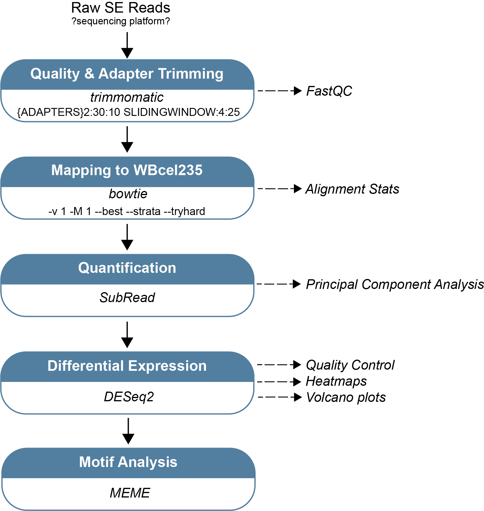

## piRNA_SexBias

## Author: Margaret R. Starostik

## Basic Overview
Identify changes in the transcriptome and transcription factor binding profiles between N2 and snpc-1.3(-) during spermatogenesis and oogenesis. 

### Data Acquisition
Raw small RNA-seq and mRNA-seq FASTA files were obtained on 6/09/2019 (Charlotte).

#### small RNA-seq
There are 18 samples total, 3 replicates for each condition.

#### ChIP-seq

#### mRNA-seq

